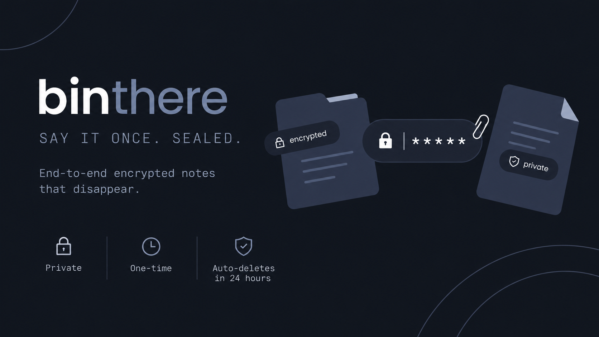

# binthere

[](https://github.com/nxfu/binthere/actions/workflows/ci.yml)
[](./LICENSE)
[](./.nvmrc)
[](https://developers.cloudflare.com/workers/)



A zero-knowledge, end-to-end encrypted pastebin. Your browser encrypts everything with
AES-256-GCM **before** it leaves your device; the server only ever stores ciphertext. The
decryption key lives in the URL fragment (`#…`) and never reaches the server.

**Live:** <https://binthere.nxfu.workers.dev>

```
you type ──▶ browser encrypts (AES-256-GCM) ──▶ Worker stores ciphertext only
                     │                                      │
              key stays in the URL #fragment          KV or Durable Object
                     │                                      │
recipient opens link ─▶ browser fetches ciphertext ─▶ browser decrypts ─▶ plaintext
```

binthere is a clean-room rebuild inspired by [PrivateBin](https://privatebin.info)'s
zero-knowledge model — modern Web Crypto, a strict CSP, atomic burn-after-read, and a real
test suite, with the ~700 KB of jQuery/Bootstrap/zlib-WASM stripped out. It runs as a single
Cloudflare Worker (Static Assets + KV + a Durable Object), so hosting is cheap and there is no
server to maintain.

## Contents

- [Features](#features)
- [How it compares](#how-it-compares)
- [Quick start](#quick-start)
- [Deployment](#deployment)
- [Architecture](#architecture)
- [Limitations](#limitations)
- [FAQ](#faq)
- [Roadmap](#roadmap)
- [Security](#security)
- [Contributing](#contributing)
- [Acknowledgements](#acknowledgements)
- [License](#license)

## Features

| Feature | Details |
| --- | --- |
| Zero-knowledge | Encryption and decryption happen only in the browser; the server stores opaque ciphertext and non-secret metadata. |
| Optional password | Layered on top of the URL key — neither alone can decrypt. |
| Burn-after-read | Every note is a strict, atomic single-consumer read (Durable Object). The first reader gets it; everyone else gets `410 Gone`. |
| Auto-expiry | Notes delete themselves after 24 hours. |
| Safe rendering | Auto-detected syntax highlighting and a safe Markdown subset (no raw HTML, sanitized links). All rendering is DOM-construction only — never `innerHTML`. |
| Sharing tools | Copy link, QR code, delete link. |
| Minimal surface | Strict CSP, self-hosted fonts, no third-party scripts, no analytics, no accounts. |

> [!NOTE]
> The wire format supports the full expiry range (5 minutes–1 year or never) and non-burn
> pastes; the current UI simply fixes 24 h + one-time view, so older links keep working.

## How it compares

All of these are solid zero-knowledge paste/secret tools — the difference is mostly in how
they are hosted and what they optimize for:

| Project | Server | Storage | Distinguishing traits |
| --- | --- | --- | --- |
| **binthere** | Cloudflare Worker (serverless, no origin server) | Workers KV + Durable Object | Frozen spec with test vectors, atomic burn-after-read, no client framework or build step |
| [PrivateBin](https://privatebin.info) | PHP | Filesystem / DB / S3 | Mature, many formats, discussions, i18n |
| [Yopass](https://github.com/jhaals/yopass) | Go | Memcached / Redis | Secret-sharing focus, CLI client |
| [cryptgeon](https://github.com/cupcakearmy/cryptgeon) | Rust | Redis | File sharing, view limits |

Pick binthere if you want a paste service you can deploy in one command with nothing to
patch, back up, or keep online yourself.

## Quick start

Requires Node.js ≥ 20 (`.nvmrc` pins 22).

```bash
npm install
npm run dev      # wrangler dev → http://127.0.0.1:8787
```

KV, the Durable Object, and rate limiting are all emulated locally — no Cloudflare account
needed for development.

| Command | Description |
| --- | --- |
| `npm run dev` | Local dev server at `http://127.0.0.1:8787` |
| `npm test` | Full Vitest suite in the real `workerd` runtime |
| `npm run test:watch` | Tests in watch mode |
| `npm run test:coverage` | Tests with coverage report |
| `npm run lint` | ESLint 9 (flat config) |
| `npm run kv:create` | Create the `PASTES` KV namespace (+ preview) |
| `npm run deploy` | Deploy to Cloudflare |

CI runs lint, a byte-for-byte test-vector diff, and the full suite.

## Deployment

[](https://deploy.workers.cloudflare.com/?url=https://github.com/nxfu/binthere)

The button above clones the repo and provisions everything declared in
[`wrangler.toml`](./wrangler.toml) — the static assets, the `PASTES` KV binding, the
`BurnPaste` Durable Object + migration, and the `CREATE_RL` rate limiter — on your own
Cloudflare account.

To deploy manually instead (note the checked-in KV ids belong to the origin deployment):

```bash
npm run kv:create        # create your own PASTES KV namespace (+ preview)
# paste the printed id / preview_id into wrangler.toml
npm run deploy           # creates the Worker, Durable Object, and rate limiter
```

<details>
<summary>Self-hosting checklist</summary>

- Replace the KV `id` / `preview_id` in `wrangler.toml` with your own (a pristine template is
  in [`wrangler.toml.example`](./wrangler.toml.example)).
- Update the hardcoded canonical URLs: `og:url` / `og:image` in `public/index.html` and
  `Canonical` in `public/.well-known/security.txt` point at `binthere.nxfu.workers.dev`; the
  footer and `security.txt` `Policy` point at `github.com/nxfu/binthere`.
- `npm run dev` works with placeholder KV ids — KV is emulated locally.

</details>

## Architecture

| Piece | Role |
| --- | --- |
| Static Assets (`public/`) | SPA frontend, served directly by the Worker |
| Worker (`src/index.js`) | `/api/*` paste API — stores ciphertext, enforces size/rate/burn |
| KV (`PASTES`) | Normal pastes, with native TTL expiry |
| Durable Object (`BurnPaste`) | Burn-after-read pastes, atomic single-consumer |
| Rate Limiting binding | Abuse mitigation on paste creation (fail-open) |

See [`ARCHITECTURE.md`](./ARCHITECTURE.md) for the request path and [`SPEC.md`](./SPEC.md) for
the exact cryptographic protocol and paste format v1, including frozen test vectors.

<details>
<summary>HTTP API</summary>

The API only ever handles ciphertext — encryption happens in the client before `POST`, and
the key fragment never appears in any request. Full details in [`SPEC.md`](./SPEC.md) §10.

| Method & path | Purpose | Success | Errors |
| --- | --- | --- | --- |
| `POST /api/paste` | Create a paste (format v1 JSON) | `201` | `400` invalid · `413` too large · `429` rate-limited |
| `GET /api/paste/:id` | Fetch a paste (consumes a burn) | `200` | `404` missing/expired · `410` burned |
| `GET /api/paste/:id?meta=1` | Peek a burn head without consuming | `200` | `404` missing · `410` burned/expired |
| `DELETE /api/paste/:id` | Delete, with `X-Delete-Token` header | `200` | `400` missing token · `403` wrong token · `404` missing |

The delete token travels in a header — never in the URL — so it cannot land in request logs;
the server stores and compares only its SHA-256.

</details>

<details>
<summary>Project layout</summary>

```
public/            static frontend (CSP-clean; served by Workers Static Assets)
  index.html  css/styles.css  js/*.js  fonts/*.woff2  img/favicon.svg
  _headers  robots.txt  opengraph.png  .well-known/security.txt
src/
  index.js         Worker: /api/paste routing + asset fallback
  burn-do.js       BurnPaste Durable Object (atomic burn-after-read)
  lib/             ids, storage routing, rate-limit wrapper
test/              vitest suites (run in workerd) + genvectors.mjs (vector regenerator)
                   + vectors.expected.txt (pinned vector output, diffed in CI)
tools/             verify-vectors.py — independent Python cross-check of the frozen vectors
SPEC.md SECURITY.md ARCHITECTURE.md
CHANGELOG.md CONTRIBUTING.md CODE_OF_CONDUCT.md LICENSE
```

`public/js/{bytes,crypto,format,markdown}.js` are shared: the browser imports them as static
assets and the Worker bundles the same files, so the paste format has a single source of truth.

</details>

## Limitations

Most of these are deliberate scope choices, not bugs. Know them before relying on binthere:

- **Not anonymous or metadata-free.** The server sees IP, timing, ciphertext size, and the
  non-secret `adata` (IVs, KDF params, format flags). It only cannot read your *plaintext*
  ([`SECURITY.md`](./SECURITY.md) §3).
- **No protection from a compromised deployment.** Decryption runs in JavaScript the server
  delivers, so a malicious or hacked host could serve code that leaks your key. In-browser E2E
  encryption trusts the origin ([`SECURITY.md`](./SECURITY.md) §4).
- **Lose the link, lose the note.** No accounts, no server-side index — the id + key exist only
  in the URL you share. Nobody, including you, can recover or list pastes.

<details>
<summary>More limitations</summary>

- **Burn passwords can be brute-forced offline.** The non-consuming peek returns the wrapped
  key so a password can be checked before the single read — someone who already has the URL
  secret can guess a weak password without burning the note. Use a strong password
  ([`SPEC.md`](./SPEC.md) §8 documents the trade-off).
- **Password KDF is PBKDF2-SHA256** (310k iterations), not a memory-hard KDF. Argon2id is on
  the roadmap.
- **The UI fixes expiry at 24 h and one-time view.** The wire format supports more; the
  controls are just hidden.
- **English only.**
- **The rate limiter fails open** — it is abuse mitigation, not access control.
- **Canonical URLs are hardcoded** to the origin deployment; update them when self-hosting
  (see [Deployment](#deployment)).

</details>

## FAQ

<details>
<summary>Can the operator read my notes?</summary>

No. Content is encrypted with AES-256-GCM in your browser before upload; the server stores
only ciphertext and non-secret metadata. The decryption key lives in the URL fragment, which
browsers never send to the server. What the server *does* see (IP, timing, sizes) is spelled
out in [`SECURITY.md`](./SECURITY.md) §3.

</details>

<details>
<summary>I lost the link — can the note be recovered?</summary>

No. There are no accounts and no server-side index; the paste id and decryption key exist
only in the URL. Without it, the ciphertext is unrecoverable — by design.

</details>

<details>
<summary>Why does my link say "expired or was already opened"?</summary>

Every note is one-time view: the first reader atomically consumes it, and everyone after
(including you, if you open your own link first) gets `410 Gone`. Notes also self-delete
after 24 hours even if never opened.

</details>

<details>
<summary>Does adding a password make the link safe to send in the clear?</summary>

It helps — the password is mixed into the key derivation, so the link alone cannot decrypt.
But someone holding the link can test passwords offline without burning the note, so a weak
password only slows them down. Use a strong password and send it over a different channel
([`SPEC.md`](./SPEC.md) §8).

</details>

<details>
<summary>What does the recipient need?</summary>

Just the link and any modern browser — Web Crypto (`SubtleCrypto`) is the only requirement.
No account, extension, or app.

</details>

<details>
<summary>Can I create pastes from a script or CLI?</summary>

The HTTP API accepts only ciphertext in paste format v1, so a client must implement the
client-side encryption described in [`SPEC.md`](./SPEC.md) (the frozen test vectors make this
verifiable). There is no official CLI yet.

</details>

## Roadmap

Deliberately out of scope for v1, roughly in priority order:

- **Argon2id** as a versioned password-KDF option alongside PBKDF2 (spec-first: vectors before code)
- **File attachments** — encrypted binary blobs with size limits (likely R2 for large files)
- **Headless-browser CSP + render test** (Playwright) in CI, asserting zero CSP violations
  across the create/view/burn flows
- Possible **comments/discussion** with per-thread encryption, and **i18n**

## Security

binthere is a security-sensitive cryptographic application. The threat model, explicit
non-goals, and vulnerability-reporting process are in [`SECURITY.md`](./SECURITY.md); the
frozen protocol and paste format live in [`SPEC.md`](./SPEC.md).

> [!IMPORTANT]
> Report suspected vulnerabilities privately to [nxfu@proton.me](mailto:nxfu@proton.me)
> (see `SECURITY.md` §8). Do not open a public issue with exploit details.

## Contributing

Issues and PRs are welcome — see [`CONTRIBUTING.md`](./CONTRIBUTING.md). Two hard rules:

1. **Crypto is spec-first.** Any change to the protocol, paste format, or canonical AAD must
   update [`SPEC.md`](./SPEC.md) *first* — never silently — then regenerate the frozen vectors
   with `node test/genvectors.mjs` (and refresh `test/vectors.expected.txt`, which CI diffs
   byte-for-byte). Never hand-edit the pinned hexes in `test/crypto.test.js`.
2. **Keep the CSP strict and rendering XSS-safe.** No inline styles/scripts, no CDNs, no
   `innerHTML` on user content. New rendering paths need a case in `test/markdown.test.js`.

Run `npm run lint` and `npm test` before opening a PR; all suites run in the real `workerd`
runtime.

## Acknowledgements

- [PrivateBin](https://privatebin.info) — the zero-knowledge pastebin whose model this is a
  clean-room rebuild of
- [qrcode-generator](https://github.com/kazuhikoarase/qrcode-generator) by Kazuhiko Arase
  (MIT) — vendored in `public/js/qrcode.js` for offline, CSP-safe QR rendering
- [Newsreader](https://fonts.google.com/specimen/Newsreader) by Production Type,
  [Geist](https://vercel.com/font) by Vercel, and
  [JetBrains Mono](https://www.jetbrains.com/lp/mono/) by JetBrains (all SIL OFL 1.1) —
  self-hosted in `public/fonts/`; license texts in
  [`public/fonts/THIRD-PARTY-NOTICES.md`](./public/fonts/THIRD-PARTY-NOTICES.md)

## License

[MIT](./LICENSE) © 2026 nxfu
